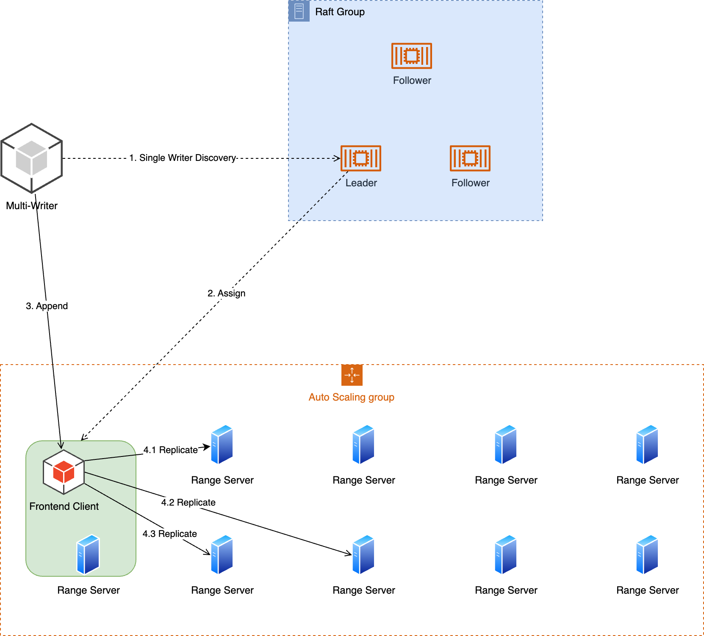

# Architecture Design

## Concepts

### Record
A record is a piece of information in your business system, representing an event in the domain, or a state change. Typically, a record contains timestamp, metadata headers, system properties and value. A record can be single or composite. A composite record holds multiple internal single ones and there is a system property length for the number of single records inside.

Record is the minimum unit of data for reading and writing in Elastic Stream.

### Range
A range contains an sequence of records. A range is replicated among a set of range servers to be resilient to occasional range server loss. On creation, ranges are mutable and ready to accept appending of records. Once sealed, they become immutable forever.

### Stream
Every stream has an unique ID in the management plane. Conceptually, a stream is an ordered list of pointers to ranges maintained by placement driver servers. Only the last range is mutable and all the prior ones are immutable.

### Placement Driver

Placement Driver(PD, hereafter) tracks ranges for each stream and manages placements for replicas of every range. PD is built on top of RAFT consensus algorithm and is off the critical path of client requests.

PD has several management responsibilities of the cluster:

* Maintain all streams and their ranges;
* Monitor the health and workload of the range servers;
* Assigning ranges to range servers on range creation request;
* Guarantee range replica completeness and integrity;
* Schedule upload of range data to object storage service;
* Garbage collect ranges that are purged from range servers;
* Re-balance traffic among range servers;

### Range Server
Each range server maintains the storage for a set of range replicas that are assigned to it by PD. Range server has few knowledge of streams, instead, it focus itself on ranges and records. A range server caches a view of ranges it owns and their peer replica placements. In case its own replica is incomplete and the range got sealed, it talks to other range servers of the same replica group to replicate data, up to acknowledged and sealed offset. Primary job of range servers is to talk to clients to append records to mutable ranges. When there is an incident, clients tell range servers to seal a range into immutable.

On receipt of uploading range data to object storage service command from PD, the range sever would initiate batch upload process and inform PD on completion.

Once range data is uploaded to object storage service and the range data become cold enough, range servers would trim or garbage collect ranges, rendering data only available on tiered object storage.

### Replication Layer
At the core, Elastic Stream follows single-writer-multiple-reader design. Single writer makes write operation routes a star topology and tolerates slow nodes according to replication policy. Multiple writers of a stream is achieved through embedding single-writer in range server.

#### Create Range
To create a new range for a stream, single writer send create-range request to PD and PD allocates ranges servers for each of its replica according workload metrics.

#### Record Appending
Streams can only be appended to; existing data cannot be modified in anyway. To make append operations efficient, batch appending is supported.

Append operation is acknowledged only after it manages to go through the replication layer, where configured number of range servers have acknowledged the append operation.

For example, stream in the diagram is configured to be 2-ack/3-replica. An append operation will not get acknowledged unless two range servers of the replica group have acknowledged and all the prior append operations get acknowledged. Specifically, Frontend Client, as the single writer of the stream, appends records 0-4 to range servers 0-2. Range server 0 is kind of slow, just acknowledged record 0-1, with record 2 just written to disk and ack response being flushed to network. Range server 1 acknowledges up to 2 and just received append request of request 3; record 4 is still inflight. Range server 2 acknowledges 0-3 and just accepts record 4; According to the replication policy, frontend client acknowledges record 0-2, even if range server 0 is slow and not yet acknowledges record 2.

#### Seal Range

* Active Seal

   If a range server lags behind a configured amount of data or for a duration for some reason, thus is unlikely to catch up within tolerable amount of time, single writer can seal the range and asks PD to allocate a new range with replication set located on different range servers.
   Active Seal Steps
   - step-0 Calculate ack offset;
   - step-1 Seal each range servers within replication set, with ack offset;
   - step-2 Seal PD with the ack offset and request PD to create a new range;

* Fail-over Seal

   In case the single writer crashed, a second frontend client need to pick up the stream and work as the single stream writer.
   - Open stream, fetch range list from PD, finding there is a orphan mutable last range;
   - Seal the last range without ack offset and each replica returns max committed offset(max continuous and committed offset of the range);
   - The client then calculates ack offset according to replication policy;
   - The client seals PD with the ack offset and its epoch.

#### Non-stop Write
Record appending is streamlined. Once a new record is pushed back into the streamline, it will be assigned a logical base offset. In case there is range server loss, frontend client may seal and walk around the fault and resume the append streamline. Aka, once the record entered the pipeline, it can only be retired after proper append and replication.

#### Multi-write
True that Elastic Stream is designed centrally on single-writer, but multi-write is made possible by adding an extra layer.

## Layers
At the highest level, our architecture is manifested as a number of layers, each of which interacts with the layers directly above and below it as relatively opaque services.

| Layer  | Order  | Goal  |
|---|---|---|
| Compute  | 1  | messaging and streaming semantics, compute scalability |
|  Elastic Stream |  2 | high performance, low latency, fault tolerance  |
|  Object Storage |  3 | Cost effective, unlimited storage capacity |

### Compute Servers
This layer offers messaging and streaming semantics.
1. Kafka
2. RocketMQ
3. RabbitMQ
4. ...

### Elastic Storage Layer
1. Extremely low latency on top of NVMe Storage: P99.9 ~= 1ms
2. Tendency to zero failover
3. Replication:
   (a) 2/3 chasing-write optimizes latency further and offers enterprise data integrity.
   (b) Choices among (1/2, 2/3) chasing-write offers even cheaper option.
4. Provides blazing fast data-read for {hot, warm} data.
5. Fill IOPS gaps between highly-concurrent record publishing and limited object-storage IOPS
6. General-purpose indexing, shared by various compute servers.

### Object Storage Layer
1. TCO reduction: order of magnitude
2. Unlimited Storage Capacity
3. Long term data reliability for the bulk of the system.
