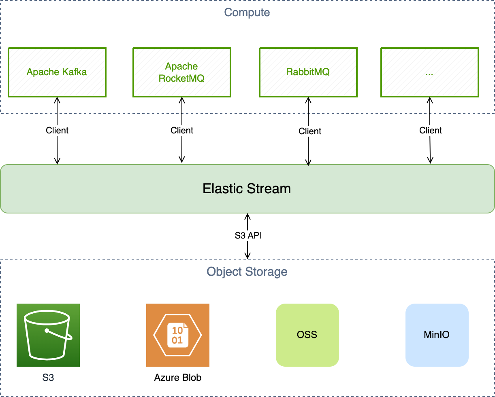

## Concepts

### Record

### Stream

### Range

### Range Server

### Placement Driver

## Layers
At the highest level, our architecture is manifested as a number of layers, each of which interacts with the layers directly above and below it as relatively opaque services.

| Layer  | Order  | Goal  |
|---|---|---|
| Compute  | 1  | messaging and streaming semantics, compute scalability |
|  Elastic Stream |  2 | high performance, low latency, fault tolerance  |
|  Object Storage |  3 | Cost effective, unlimited storage capacity |

### Compute Servers
This layer offers messaging and streaming semantics.
1. Kafka
2. RocketMQ
3. RabbitMQ
4. ...

### Elastic Storage Layer
1. Extremely low latency on top of NVMe Storage: P99.9 ~= 1ms
2. Tendency to zero failover
3. Replication:
   (a) 2/3 chasing-write optimizes latency further and offers enterprise data integrity.
   (b) Choices among (1/2, 2/3) chasing-write offers even cheaper option.
4. Provides blazing fast data-read for {hot, warm} data.
5. Fill IOPS gaps between highly-concurrent record publishing and limited object-storage IOPS
6. General-purpose indexing, shared by various compute servers.

### Object Storage Layer
1. TCO reduction: order of magnitude
2. Unlimited Storage Capacity
3. Long term data reliability for the bulk of the system.
