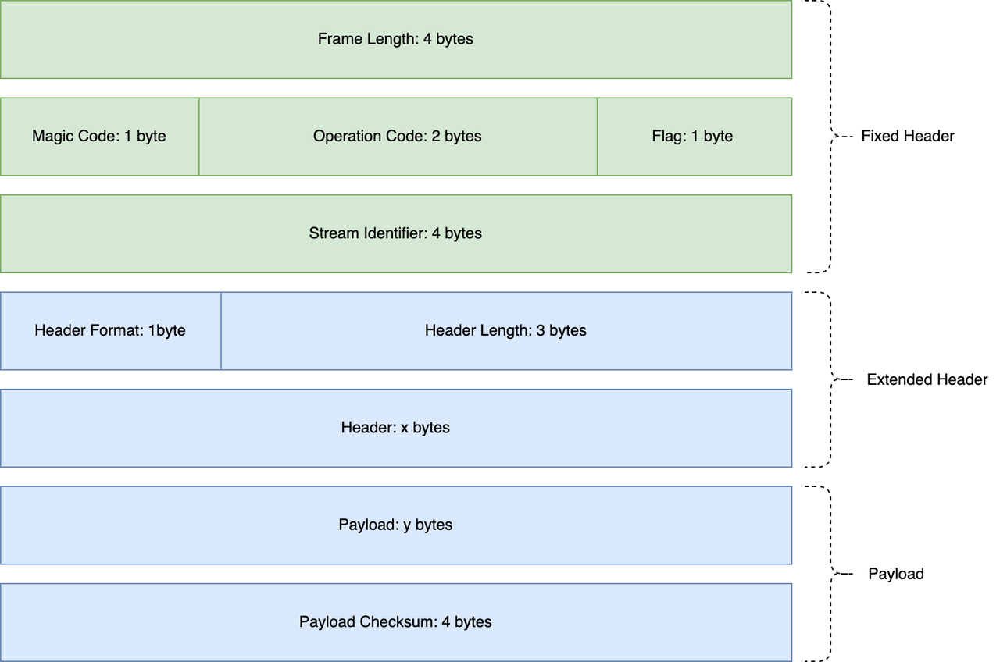

# Streaming Batch Protocol(SBP) v0.1

## Overview

The Streaming Batch Protocol (SBP) is a frame base protocol. All frames begin with a fixed 12-octet header, followed by an extended header and payload. Below graph shows the layout of a frame.

[](images/sbp_layout.png)

The protocol is big-endian (network byte order).

Each frame contains a fixed-size header followed by a variable-size extended header and payload. The header is described in Section 2. The content of the extended header and payload depends on the header operation code. The list of supported operation codes and the details of the payload are described in Section 4. The frame's payload is opaque to the SBP frame format and is interpreted by the application layer.

The design of SBP follows two principles:
- Batch: SBP is designed to support batch processing, which means that the client can send multiple requests in one frame, and vice versa. This is useful for reducing the overhead of network communication.
- Streaming: The server does not need to respond to all the requests in a single batch, which means that the server could respond to the requests in a streaming way to reduce the latency of the response.

## Frame Header
The Frame Header is a fixed 12-octet header that appears at the beginning of every frame. It contains fields for the Frame Length, Magic Code, Operation Code, Flags, and Stream Identifier.

### Frame Length
The length of the frame is expressed as a 32-bit integer. `Frame Length` = 16 + `Header.length` + `Payload.length`.
### Magic Code
A fixed value representing the protocol self. Currently, the value is 23. This field is used to detect the presence of the SBP protocol, and implementations MUST discard any frame that does not contain the correct magic number.
### Operation Code
The 16-bit opcode of the frame. The frame opcode determines the format and semantics of the frame. Implementations MUST ignore and discard any frame with an unknown opcode.
### Flags
Flags apply to this frame. The flags have the following meaning (described by the mask that allows selecting them):
- 0x01: Response flag. If set, the frame contains the response payload to a specific request frame identified by a stream identifier. If not set, the frame represents a request frame.
- 0x02: Response end flag. If set, the frame is the last frame in a response sequence. If not set, the response sequence continues with more frames. The response sequence may contain one or more frames.
- 0x04: System error flag. If a response frame has the this flag set, its extended header will be type of `SystemErrorResponse`.

The rest of the flags are currently unused and ignored.
### Stream Identifier
A unique identifier for a request frame or a stream request frame. That is, it is used to support request-response or streaming communication models simultaneously. The stream identifier is expressed as a 32-bit integer in network byte order.

When communicating with the server, the client must set this stream id to a non-negative value. It is ensured that the request and response frames will have matching stream ids.
### Extended Header
The extended header starts with format and length fields. The format field is used to identify the serialization format of the extended header. The length field is used to determine the length of the extended header. The length field is expressed as a 24-bit integer in network byte order. The extended header is followed by the payload.

Currently, SBP only defines one format type:
- 0x01: FlatBuffers format indicates that the payload of the extended header is serialized by flatbuffers.

## Frame Definitions
This specification outlines various types of frames, each with a unique 16-bit opcode to identify them. Each frame type has its own specific extended header and payload.

The table below shows all the supported frame types along with a preallocated opcode.

| Opcode | Frame Type | Description |
|--------|------------|-------------|
| 0x0001 | PING | Measure a minimal round-trip time from the sender. |
| 0x0002 | GOAWAY | Initiate a shutdown of a connection or signal serious error conditions. |
| 0x0003 | HEARTBEAT | To keep clients alive through periodic heartbeat frames. |
| 0x0004 | ALLOCATE_ID | Allocate a unique identifier from placement managers. |
| 0x1001 | APPEND | Append records to the data node. |
| 0x1002 | FETCH | Fetch records from the data node. |
| 0x2001 | LIST_RANGES | List ranges from the PM of a batch of streams. |
| 0x2002 | SEAL_RANGES | Request seal ranges of a batch of streams. The PM will provide the `SEAL_AND_NEW` semantic while Data Node only provide the `SEAL` semantic. |
| 0x2003 | SYNC_RANGES | Syncs newly writable ranges to a data node to accelerate the availability of a newly created writable range. |
| 0x2004 | DESCRIBE_RANGES | Describe the details of a batch of ranges, mainly used to get the max offset of the current writable range. |
| 0x3001 | CREATE_STREAMS | Create a batch of streams. |
| 0x3002 | DELETE_STREAMS | Delete a batch of streams. |
| 0x3003 | UPDATE_STREAMS | Update a batch of streams. |
| 0x3004 | DESCRIBE_STREAMS | Fetch the details of a batch of streams. |
| 0x3005 | TRIM_STREAMS | Trim the min offset of a batch of streams. |
| 0x4001 | REPORT_METRICS | Data node reports metrics to the PM. |

The below sub-sections describe the details of each frame type, including their usage, their binary format, and the meaning of their fields.

### PING
The PING frame (opcode=0x0001) is a mechanism for measuring a minimal round-trip time from the sender, as well as determining whether an idle connection is still functional. PING frames can be sent from any endpoint.

Receivers of a PING frame set the response flag and the response end flag to do a PONG, with the same extended headers and payload.

### GOAWAY
The GOAWAY frame (opcode=0x0002) is used to initiate the shutdown of a connection or to signal serious error conditions. GOAWAY allows an endpoint to gracefully stop accepting new streams while still finishing the processing of previously established streams. This enables administrative actions, like server maintenance.

### HEARTBEAT
The HEARTBEAT frame(opcode=0x0003) is used to keep clients alive, carrying the necessary role and status information.

The client can send a heartbeat frame to the server periodically. If the server does not receive any heartbeat frame from the client for a long time, the server may close the connection, even clean up the resources of the client.

**Request Frame:**

```
Request Header => client_id client_role data_node
  client_id => string
  client_role => enum {DATA_NODE, CLIENT}
  data_node => node_id advertise_addr
    node_id => int32
    advertise_addr => string

Request Payload => Empty
```

**Response Frame:**
```
Response Header => client_id client_role data_node
  client_id => string
  client_role => enum {DATA_NODE, CLIENT}
  data_node => node_id advertise_addr
    node_id => int32
    advertise_addr => string
  status => code message detail
    code => int16
    message => string
    detail => bytes

Response Payload => Empty
```

The request and response frames of HEARTBEAT have the same format. The table below shows the meaning of each field.

| Field | Type | Description |
|-------|------|-------------|
| client_id | string | The unique id of the client. |
| client_role | enum | The role of the client. Note the client is a relative term, it can be a data node or a SDK client. |
| data_node | struct | Optional, the node information of the data node. Empty if the client is a SDK client. |
| node_id | int32 | The unique id of the node. |
| advertise_addr | string | The advertise address of the node, for client traffic from outside. The scheme is `host:port`, while host supports both domain name and IPv4/IPv6 address. |
| status | struct | The error status of the response. |
| code | int16 | The error code of the response. |
| message | string | The error message of the response. |
| detail | bytes | Additional information about the error. |


### ALLOCATE_ID
The ALLOCATE_ID frame(opcode=0x0004) allocates a unique identifier from placement managers.

**Request Frame:**
```
Request Header => timeout_ms, host

Request Payload => Empty
```

| Field | Type | Description |
|-------|------|-------------|
| timeout_ms| int32 | Request would be valid within the duration in milliseconds |
| host  | String| Host name of the applicant |

** Response Frame:**
```
Response Header => id
  status => code message detail
    code => int16
    message => string
    detail => bytes

Response Payload => Empty
```

### APPEND
The APPEND frame(opcode=0x1001) appends record batches to the data node.

**Request Frame:**
```
Request Header => timeout_ms [append_request]
  timeout_ms => int32
  append_requests => stream_id request_index batch_length
    stream_id => int64
    request_index => int32
    batch_length => int32
  
Request Payload => [stream_data]
  stream_data => record_batch
    record_batch => bytes
```

| Field | Type | Description |
|-------|------|-------------|
| timeout_ms | int32 | The timeout to await a response in milliseconds. |
| append_requests | array | A batch of append requests. |
| stream_id | int64 | The id of the stream. |
| request_index | int32 | The index number of an append request in the batch requests. The response to each request may be out of order, even in different response frames. |
| batch_length | int32 | The payload length of this record batch. |
| stream_data | array | The array of record batches. |
| record_batch | bytes | The payload of each record batch, already serialized by clients. |

**Response Frame:**
```
Response Header => throttle_time_ms [append_responses] 
  throttle_time_ms => int32
  status => code message detail
    code => int16
    message => string
    detail => bytes
  append_responses => stream_id request_index base_offset stream_append_time_ms status
    stream_id => int64
    request_index => int32
    base_offset => int64
    stream_append_time_ms => int64
    status => code message detail
      code => int16
      message => string
      detail => bytes

Response Payload => Empty
```

| Field | Type | Description |
|-------|------|-------------|
| throttle_time_ms | int32 | The time in milliseconds to throttle the client, due to a quota violation or the server is too busy. |
| status | struct | The error status of the response. |
| code | int16 | The top level error code of the response. |
| message | string | The top level error message of the response. |
| detail | bytes | Additional information about the error. |
| append_responses | array | A batch of append responses. |
| stream_id | int64 | The target stream_id of the append record batch. |
| request_index | int32 | The request_index that the append_response relates to. |
| base_offset | int64 | The base offset of the record batch. |
| stream_append_time_ms | int64 | The timestamp returned by the data node server after appending the records. |
| status | struct | The error status of a fetch response. |
| code | int16 | The error code, or 0 if there was no error. |
| message | string | The error message, or null if there was no error. |
| detail | bytes | Additional information about the error. |

### FETCH
The FETCH frame(opcode=0x1002) fetches record batches from the data node. This frame supports fetching data from multiple streams in one frame, and the response could be split into multiple frames then returned in a streaming way. The best benefit of this behavior is that the storage server could return records timely according to the arrival of the records, which is very useful for real-time data processing.

**Request Frame:**
```
Request Header => max_wait_ms min_bytes [fetch_requests]
  max_wait_ms => int32
  min_bytes => int32
  fetch_requests => stream_id fetch_offset batch_max_bytes
    stream_id => int64
    request_index => int32
    fetch_offset => int64
    batch_max_bytes => int32
  
Request Payload => Empty
```

| Field | Type | Description |
|-------|------|-------------|
| max_wait_ms | int32 | The maximum time in milliseconds to wait for the response. |
| min_bytes | int32 | The maximum time in milliseconds to wait for the response. |
| fetch_requests | array | A batch of fetch requests to fetch data from different streams. |
| stream_id | int64 | A specific stream to fetch data. |
| request_index | int32 | The index number of a fetch request in the batch requests. The response to each request may be out of order, even in different response frames. |
| fetch_offset | int64 | The start offset to fetch data in a specific stream. |
| batch_max_bytes | int32 | The maximum bytes of the current batch to fetch from the stream. |

**Response Frame:**
```
Response Header => throttle_time_ms [fetch_responses]
  throttle_time_ms => int32
  status => code message detail
    code => int16
    message => string
    detail => bytes
  fetch_responses => stream_id request_index batch_length status
    stream_id => int64
    request_index => int32
    batch_length => int32
    status => code message detail
      code => int16
      message => string
      detail => bytes

Response Payload => [stream_data]
  stream_data => record_batch
    record_batch => bytes
```

| Field | Type | Description |
|-------|------|-------------|
| throttle_time_ms | int32 | The time in milliseconds to throttle the client, due to a quota violation or the server is too busy. |
| status | struct | The error status of the response. |
| code | int16 | The top level error code of the response. |
| message | string | The top level error message of the response. |
| detail | bytes | Additional information about the error. |
| fetch_responses | array | A batch of fetch responses. |
| stream_id | int64 | The id of the stream that the data is fetched from. |
| request_index | int8 | The request_index that the fetch_response relates to. |
| batch_length | int32 | The data length of the returned batch is used to decode the data from the payload. |
| status | struct | The error status of a fetch response. |
| code | int16 | The error code, or 0 if there was no error. |
| message | string | The error message, or null if there was no error. |
| detail | bytes | Additional information about the error. |
| stream_data | array | The array of record batches, fetched from multiple stream ranges. |
| record_batch | bytes | The payload of each record batch, already serialized. |

### LIST_RANGES
The LIST_RANGES frame(opcode=0x2001) lists the ranges of a batch of streams. Or it could list the ranges of all the streams in a specific data node.

**Request Frame:**

There are two types of LIST_RANGES request, one is to list the ranges of a batch of streams, and the other is to list the ranges of all the streams in a specific data node.

```
Request Header => timeout_ms [range_owners]
  timeout_ms => int32
  range_owners => union { stream_id, data_node }
    // List the ranges of streams
    stream_id => int64
    // List the ranges of a specific data node
    data_node => node_id advertise_addr
      node_id => int32
      advertise_addr => string
  
Request Payload => Empty
```

| Field | Type | Description |
|-------|------|-------------|
| timeout_ms | int32 | The timeout in milliseconds to wait for the response. |
| range_owners | union | The array of owner of the ranges to list. |
| stream_id | int64 | A specific stream to list the ranges. |
| data_node | struct | A specific data node to list the ranges of all the streams. |
| node_id | int32 | The node id of the data node. |
| advertise_addr | string | The advertise address of the data node. |

**Response Frame:**

```
Response Header => throttle_time_ms [list_responses]
  throttle_time_ms => int32
  status => code message detail
    code => int16
    message => string
    detail => bytes
  list_responses => stream_id status [ranges]
    stream_id => int64
    status => code message detail
      code => int16
      message => string
      detail => bytes
    ranges => stream_id range_index start_offset next_offset end_offset [replica_nodes]
      stream_id => int64
      range_index => int32
      start_offset => int64
      next_offset => int64
      end_offset => int64
      replica_nodes => data_node is_primary
        data_node => node_id advertise_addr
          node_id => int32
          advertise_addr => string
        is_primary => bool
  
Response Payload => Empty
```

| Field | Type | Description |
|-------|------|-------------|
| throttle_time_ms | int32 | The time in milliseconds to throttle the client, due to a quota violation or the server is too busy. |
| status | struct | The error status of the response. |
| code | int16 | The top level error code of the response. |
| message | string | The top level error message of the response. |
| detail | bytes | Additional information about the error. |
| list_responses | array | A batch of list range responses. |
| stream_id | int64 | The target stream_id of the list ranges response. |
| status | struct | The error status of a fetch response. |
| code | int16 | The error code, or 0 if there was no error. |
| message | string | The error message, or null if there was no error. |
| detail | bytes | Additional information about the error. |
| ranges | array | The array of ranges, belonging to a specific stream. |
| range_index | int32 | The index of the range in the stream. |
| start_offset | int64 | The start offset of the range. |
| next_offset | int64 | The next writable offset for incoming records of the range. It's a snapshot of the next offset of the range, and it may be changed after the response is sent. |
| end_offset | int64 | Optional. The end offset of the range. Empty if the range is open. |
| replica_nodes | array | The array of nodes that host the range, containing the data node information of the range. |
| data_node | struct | The data node information of the range. |
| node_id | int32 | The node id of the data node. |
| advertise_addr | string | The advertise address of the data node. |
| is_primary | bool | Whether the range in current data node is primary or secondary. | 

### SEAL_RANGES
The SEAL_RANGES frame(opcode=0x2002) seals the current writable ranges of a batch of streams.

**Request Frame:**
```
Request Header => timeout_ms [ranges]
  timeout_ms => int32
  ranges => stream_id range_index
    stream_id => int64
    range_index => int32
  
Request Payload => Empty
```

| Field | Type | Description |
|-------|------|-------------|
| timeout_ms | int32 | The timeout in milliseconds to wait for the response. |
| ranges | array | A batch of ranges to seal. |
| stream_id | int64 | A specific stream that the range belongs to. |
| range_index | int32 | A specific range to seal in the stream. |

**Response Frame:**
```
Response Header => throttle_time_ms [seal_responses]
  throttle_time_ms => int32
  status => code message detail
    code => int16
    message => string
    detail => bytes
  seal_responses => stream_id status [ranges]
    stream_id => int64
    status => code message detail
      code => int16
      message => string
      detail => bytes
    range => ...
  
Response Payload => Empty
```

| Field | Type | Description |
|-------|------|-------------|
| throttle_time_ms | int32 | The time in milliseconds to throttle the client, due to a quota violation or the server is too busy. |
| status | struct | The error status of the response. |
| code | int16 | The top level error code of the response. |
| message | string | The top level error message of the response. |
| detail | bytes | Additional information about the error. |
| seal_responses | array | A batch of stream responses. |
| stream_id | int64 | The target stream_id of the seal ranges response. |
| status | struct | The error status of a fetch response. |
| code | int16 | The error code, or 0 if there was no error. |
| message | string | The error message, or null if there was no error. |
| detail | bytes | Additional information about the error. |
| range | struct | Both the PM and the data node will handle the seal ranges request. The data node returns the sealed range, while the PM returns the newly writable range. |

### SYNC_RANGES
The SYNC_RANGES frame(opcode=0x2003) syncs newly writable ranges to accelerate the availability of a newly created writable range.

Or, it could be used to assign a new replics of a range to a new data node.

**Request Frame:**
```
Request Header => timeout_ms [stream_ranges]
  timeout_ms => int32
  stream_ranges => stream_id [ranges]
    stream_id => int64
    ranges => ...
  
Request Payload => Empty
```

| Field | Type | Description |
|-------|-------|-------------|
| timeout_ms | int32 | The timeout in milliseconds to wait for the response. |
| stream_ranges | array | A batch of stream ids to sync the ranges. |
| stream_id | int64 | A specific stream to sync the ranges. |
| ranges | array | A specific range to sync to the data node. |

**Response Frame:**
```
Response Header => throttle_time_ms [sync_responses]
  throttle_time_ms => int32
  status => code message detail
    code => int16
    message => string
    detail => bytes
  sync_responses => stream_id status range
    stream_id => int64
    status => code message detail
      code => int16
      message => string
      detail => bytes
    ranges => ...
  
Response Payload => Empty
```

The response frame is similar to the request frame, so the detailed description is omitted.

### DESCRIBE_RANGES
The DESCRIBE_RANGES frame(opcode=0x2004) describes the ranges of a batch of streams. Usually, the client will use this frame to get the newly end offset of the stream after the write operation.

**Request Frame:**
```
Request Header => timeout_ms [ranges]
  timeout_ms => int32
  ranges => stream_id range_index
    stream_id => int64
    range_index => int32
```

| Field | Type | Description |
|-------|------|-------------|
| timeout_ms | int32 | The timeout in milliseconds to wait for the response. |
| ranges | array | A range array to describe. |
| stream_id | int64 | A specific stream to describe the ranges. |
| range_index | int32 | A specific range to describe. |

**Response Frame:**
```
Response Header => throttle_time_ms [describe_responses]
  throttle_time_ms => int32
  status => code message detail
    code => int16
    message => string
    detail => bytes
  describe_responses => stream_id status range
    stream_id => int64
    status => code message detail
      code => int16
      message => string
      detail => bytes
    range => ...
```

| Field | Type | Description |
|-------|------|-------------|
| throttle_time_ms | int32 | The time in milliseconds to throttle the client, due to a quota violation or the server is too busy. |
| status | struct | The error status of the response. |
| code | int16 | The top level error code of the response. |
| message | string | The top level error message of the response. |
| detail | bytes | Additional information about the error. |
| describe_responses | array | A batch of describe responses. |
| stream_id | int64 | The target stream_id of the describe ranges response. |
| status | struct | The error status of a fetch response. |
| code | int16 | The error code, or 0 if there was no error. |
| message | string | The error message, or null if there was no error. |
| detail | bytes | Additional information about the error. |
| range | struct | The range, returned by the describe ranges request. |

### CREATE_STREAMS
The CREATE_STREAMS frame(opcode=0x3001) creates a batch of streams to PM. This frame with batch ability is very useful for importing metadata from other systems.

**Request Frame:**
```
Request Header => timeout_ms [streams]
  timeout_ms
  streams => replica_nums retention_period_ms
    replica_nums => int8
    retention_period_ms => int64
  
Request Payload => Empty
```

| Field | Type | Description |
|-------|------|-------------|
| timeout_ms | int32 | The timeout in milliseconds to wait for the response. |
| streams | array | A batch of streams to create. |
| replica_nums | int8 | The number of replicas of the stream. |
| retention_period_ms | int64 | The retention period of the records in the stream in milliseconds. |

**Response Frame:**
```
Response Header => throttle_time_ms [create_responses]
  throttle_time_ms => int32
  status => code message detail
    code => int16
    message => string
    detail => bytes
  create_responses => stream replica_nums retention_period_ms status
    stream => stream_id replica_nums retention_period_ms
        stream_id => int64
        replica_nums => int8
        retention_period_ms => int64
    status => code message detail
      code => int16
      message => string
      detail => bytes

Response Payload => Empty
```

| Field | Type | Description |
|-------|------|-------------|
| throttle_time_ms | int32 | The time in milliseconds to throttle the client, due to a quota violation or the server is too busy. |
| status | struct | The error status of the response. |
| code | int16 | The top level error code of the response. |
| message | string | The top level error message of the response. |
| detail | bytes | Additional information about the error. |
| create_responses | array | A batch of create stream responses. |
| stream | struct | The struct of createed stream, returned by the create streams request. |
| stream_id | int64 | The stream_id of the create streams response. |
| replica_nums | int8 | The number of replicas of the stream. |
| retention_period_ms | int64 | The retention period of the records in the stream in milliseconds. |
| status | struct | The error status of a fetch response. |
| code | int16 | The error code, or 0 if there was no error. |
| message | string | The error message, or null if there was no error. |
| detail | bytes | Additional information about the error. |

### DELETE_STREAMS
The DELETE_STREAMS frame(opcode=0x3002) deletes a batch of streams to PM or data node. The PM will delete the stream metadata as well as the range info, while the data node only marks the stream as deleted to reject the new write requests timely.

**Request Frame:**
```
Request Header => timeout_ms [streams]
  timeout_ms
  streams => stream_id replica_nums retention_period_ms
    stream_id => int64
    replica_nums => int8
    retention_period_ms => int64
  
Request Payload => Empty
```

Only the stream_id is required in the request frame, the other fields are ignored.

The frame is simple, so the detailed description is omitted.

**Response Frame:**
```
Response Header => throttle_time_ms [delete_responses]
  throttle_time_ms => int32
  status => code message detail
    code => int16
    message => string
    detail => bytes
  responses => deleted_stream status
    deleted_stream => stream_id replica_nums retention_period_ms
      stream_id => int64
      replica_nums => int8
      retention_period_ms => int64
    status => code message detail
      code => int16
      message => string
      detail => bytes
  
Request Payload => Empty
```

The deleted_stream will be returned if the stream is deleted successfully, otherwise the code and message in error status will be returned.

The frame is simple, so the detailed description is omitted.

### UPDATE_STREAMS
The UPDATE_STREAMS frame(opcode=0x3003) updates a batch of streams to PM. The frame is similar to the CREATE_STREAMS frame

**Request Frame:**
```
Request Header => timeout_ms [streams]
  timeout_ms
  streams => stream_id replica_nums retention_period_ms
    stream_id => int64
    replica_nums => int8
    retention_period_ms => int64
  
Request Payload => Empty
```

**Response Frame:**
```
Response Header => throttle_time_ms [update_responses]
  throttle_time_ms => int32
  status => code message detail
    code => int16
    message => string
    detail => bytes
  update_responses => updated_stream status
    updated_stream => stream_id replica_nums retention_period_ms
      stream_id => int64
      replica_nums => int8
      retention_period_ms => int64
    status => code message detail
      code => int16
      message => string
      detail => bytes
  
Response Payload => Empty
```

These two frames are similar with the CREATE_STREAMS frame, so the detailed description is omitted.
### DESCRIBE_STREAMS
The DESCRIBE_STREAMS frame(opcode=0x3004) describes a batch of streams from PM. The response frame is similar to the CREATE_STREAMS frame.

**Request Frame:**
```
Request Header => timeout_ms [stream_ids]
  timeout_ms
  stream_ids => stream_id
    stream_id => int64
  
Request Payload => Empty
```

**Response Frame:**
```
Response Header => throttle_time_ms [describe_responses]
  throttle_time_ms => int32
  status => code message detail
    code => int16
    message => string
    detail => bytes
  describe_responses => stream status
    stream => stream_id replica_nums retention_period_ms
      stream_id => int64
      replica_nums => int8
      retention_period_ms => int64
    status => code message detail
      code => int16
      message => string
      detail => bytes
  
Response Payload => Empty
```

### TRIM_STREAMS
The TRIM_STREAMS frame(opcode=0x3005) trims a batch of streams to PM.

The data node stores the records in the stream in a log structure, and the records are appended to the end of the log. Consider the length of disk is limited, the data node will delete the records to recycling the disk space. Once the deletion occurs, some ranges should be trimmed to avoid the clients to read the deleted records. 

The data node will send the TRIM_STREAMS frame to the PM to trim the stream with a trim offset. The PM will delete the ranges whose end offset is less than the trim offset and shrink the ranges whose start offset is less than the trim offset.

**Request Frame:**
```
Request Header => timeout_ms [trimmed_streams]
  timeout_ms
  trimmed_streams => stream_id trim_offset
    stream_id => int64
    trim_offset => int64
```

| Field | Type | Description |
|-------|------|-------------|
| timeout_ms | int32 | The timeout in milliseconds to wait for the response. |
| trimmed_streams | array | A batch of streams to trim. |
| stream_id | int64 | The stream_id of the stream to trim. |
| trim_offset | int64 | The trim offset of the stream. |

**Response Frame:**
```
Response Header => throttle_time_ms [streams]
  throttle_time_ms => int32
  status => code message detail
    code => int16
    message => string
    detail => bytes
  streams => trimmed_stream status range
    trimmed_stream => stream_id replica_nums retention_period_ms
      stream_id => int64
      replica_nums => int8
      retention_period_ms => int64
    status => code message detail
      code => int16
      message => string
      detail => bytes
    range => ...
```

| Field | Type | Description |
|-------|------|-------------|
| throttle_time_ms | int32 | The time in milliseconds to throttle the client, due to a quota violation or the server is too busy. |
| status | struct | The error status of the response. |
| code | int16 | The top level error code of the response. |
| message | string | The top level error message of the response. |
| detail | bytes | Additional information about the error. |
| streams | array | A batch of stream responses. |
| stream_id | int64 | The stream_id of the trim streams response. |
| status | struct | The error status of a fetch response. |
| code | int16 | The error code, or 0 if there was no error. |
| message | string | The error message, or null if there was no error. |
| detail | bytes | Additional information about the error. |
| range | struct | The smallest range of the stream after a trim operation. |

### REPORT_METRICS
The REPORT_METRICS frame(opcode=0x4001) reports load metrics of Data Node to PM. PM uses these metrics to allocate ranges.

**Request Frame:**
```
Request Header => data_node
  data_node => node_id advertise_addr
    node_id => int32
    advertise_addr => string
  disk_in_rate => int64
  disk_out_rate => int64
  disk_free_space => int64
  disk_unindexed_data_size => int64
  memory_used => int64
  uring_task_rate => int16
  uring_inflight_task_cnt => int16
  uring_pending_task_cnt => int32
  uring_task_avg_latency => int16
  network_append_rate => int16
  network_fetch_rate => int16
  network_failed_append_rate => int16
  network_failed_fetch_rate => int16
  network_append_avg_latency => int16
  network_fetch_avg_latency => int16
  range_missing_replica_cnt => int16
  range_active_cnt => int16

Request Payload => Empty
```

| Field | Type | Description |
|-------|------|-------------|
| hostname | string | Data Node's hostname. |
| disk_in_rate | int64 | Number of bytes written to the disk per second. |
| disk_out_rate | int64 | Number of bytes read from the disk per second. |
| disk_free_space | int64 | Disk free space size, measured in bytes. |
| disk_unindexed_data_size | int64 | Size of the data that has not yet been indexed, measured in bytes. |
| memory_used | int64 | Used memory size, measured in bytes. |
| uring_task_rate | int16 | Number of tasks completed per second in uring. |
| uring_inflight_task_cnt | int16 | Number of inflight tasks in uring. |
| uring_pending_task_cnt | int32 | Number of pending tasks in uring. |
| uring_task_avg_latency | int16 | Average latency of completed tasks over the past minute in uring, measured in ms. |
| network_append_rate | int16 | Number of append requests per second. |
| network_fetch_rate | int16 | Number of fetch requests per second. |
| network_failed_append_rate | int16 | Number of failed append requests per second. |
| network_failed_fetch_rate | int16 | Number of failed fetch requests per second. |
| network_append_avg_latency | int16 | Average latency of append requests over the past minute, measured in ms. |
| network_fetch_avg_latency | int16 | Average latency of fetch requests over the past minute, measured in ms. |
| range_missing_replica_cnt | int16 | Number of replicas that need to be copied from other Data Node. |
| range_active_cnt | int16 | Number of active(recently read or write) ranges in the past minute. |

**Response Frame:**
```
Response Header => data_node
  data_node => node_id advertise_addr
    node_id => int32
    advertise_addr => string
  status => code message detail
    code => int16
    message => string
    detail => bytes

Response Payload => Empty
```

## Error Codes

The SBP protocol defines a set of numeric error codes that are used to indicate the type of occurred error. These error codes are used in the status.code field of the response header, and can be translated by the client to a human-readable error message.

### System Error Frame
There is a special error frame that is used to indicate that the server encountered an unexpected error or a request-agnostic error. The error frame is sent with the following format:

```
Error Response Header => status
  status => code message detail
    code => int16
    message => string
    detail => bytes
```

When the system error flag is set, the above error frame is sent instead of the normal response frame.
### Error Codes Table

The error codes are defined in the following table.

| ERROR | CODE | RETRIABLE | DESCRIPTION |
|-------|------|-----------|-------------|
| NONE | 0 | No | No error |
| UNKNOWN | 1 | No | An unexpected server error |
| INVALID_REQUEST | 2 | No | The request is invalid |
| UNSUPPORTED_VERSION | 3 | No | The version of the request is not supported |
| PM_NOT_LEADER | 5 | No | The requested PM node is not the leader. |

## References

1. HTTP2: https://httpwg.org/specs/rfc7540.html
2. FlatBuffers: https://google.github.io/flatbuffers/
3. CQL BINARY PROTOCOL v4: https://github.com/apache/cassandra/blob/trunk/doc/native_protocol_v4.spec
4. Kafka Protocol: https://kafka.apache.org/protocol.html#protocol_versioning